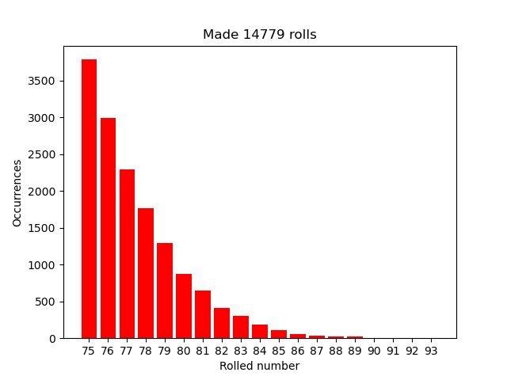

# Overview
This is simple python script for rolling highest value when creating charname in Baldur's Gate Game

Tested with Baldur's Gate: Siege of Dragonspear and Baldur's Gate II from steam
Not tested with plain Baldur's Gate I, bus should work the same as with BG SOD

# Usage:
install requirements

Baldur's Gate need to be opened in window mode on top
It'll work no matter of size or window position

```
python baldur.py bg_version
bg_version: SOD / BG1 / BG2
```

